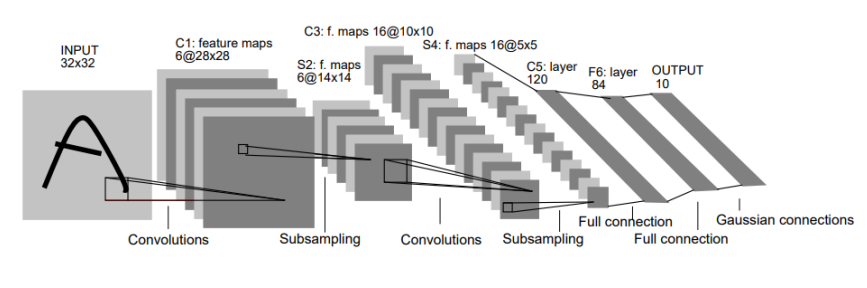

# mnist_tutorial
A tutorial for MNIST handwritten digit classification using sklearn, PyTorch and Keras.
Homework finished by yifan Chou 518030910291

# Code structure
Here I choose to finish the  [`pytorch.ipynb`](pytorch.ipynb) instead of [`keras.ipynb`](keras.ipynb). 
The finished files are as below:

* [`numpy_matplotlib_sklearn.ipynb`](numpy_matplotlib_sklearn.ipynb): for numpy, matplotlib and sklearn.
* [`pytorch.ipynb`](pytorch.ipynb): for pytorch.

* Reference solution: (not published yet)
    * [`numpy_matplotlib_sklearn_solution.ipynb`](numpy_matplotlib_sklearn_solution.ipynb)
    * [`pytorch_solution.ipynb`](pytorch_solution.ipynb)
    * [`keras_solution.ipynb`](keras_solution.ipynb)

# Requirements
I finished the homework in the following environments:
* Windows 10
* python 3.7.3
* numpy 1.19.5
* matplotlib 3.4.1
* sklearn 0.24.1 (Thus the data type after reading dataset is pandas.dataframe instead of numpy, however, it doesn't matter when running the notebook)
* torch 1.7.0
* torchvision 0.8.1

# The results for functions in sklearn
In [`numpy_matplotlib_sklearn.ipynb`](numpy_matplotlib_sklearn.ipynb), I finished the codes for three different methods: 
*  logistic regression(with default parameters)
*  the naive bayes(Bernoulli, with default parameters)
* the support vector machine(with default parameters) 

Meanwhile, in order to increase the testing accuracy, I also changed the parameters in SVM such as the penalty scalar and the max iterations as below:

`SVM = LinearSVC(C = 0.01, tol=0.0001, max_iter=10000)`

The training accuracies and testing accuracies (answers for Q1,Q2,Q3 and Q4) are as below:
method | training accuracy | testing accuracy
-|-|-
logistic regression | 97.42% | 87.60%
the naive bayes | 82.17% | 79.80%
the support vector machine | 97.97% | 86.80%
the changed support vector machine | 92.28% | 88.60% 

# The Net for MNIST
In [`pytorch.ipynb`](pytorch.ipynb), I constructed a simple net for training the MNIST dataset. For MNIST, there is a suitable net called `Lenet5`, the layers of its structure are as the picture shown:

                                                 Figure 1. Structure of Lenet5
* 1. Layer C1: convolutional layer with 6 feature maps and each unit in each feature map is
connected to a 5 × 5 neighborhoods in the input. C1 contains 156 training parameters and
122304 connections.
* 2. Layer S2: sub-sampling layer with 6 feature maps of size 14 × 14. Each unit is connected to
a 2 × 2 neighborhoods in C1. S2 contains 12 training parameters and 5880 connections.
* 3. Layer C3: convolutional layer with 16 feature maps and each unit is connected to 5 × 5
neighborhoods in S2. C3 contains 1516 training parameters and 151600 connections.
* 4. Layer S4: sub-sampling layer with 16 feature maps of size 5 × 5 and each unit is connected
to 2 × 2 neighborhoods in C3. S3 contains 32 training parameters and 2000 connections.
* 5. Layer C5: convolutional layer with 120 feature maps and each unit is connected to 5 × 5
neighborhoods in S4. C5 contains 48120 trainable connections.
* 6. Layer F6: full connection layer with 84 units in C5. F6 contains 10164 training parameter.
* 7. Layer O7: output layer with units number of classes(here is 10).

The code is as below:
```python
class SimpleNet(nn.Module):
    # TODO:define model
    # initialize the model
    def __init__(self):
        super().__init__()
        self.layer = nn.Sequential(
            nn.Conv2d(1, 6, 5, padding = 2),
            nn.ReLU(),
            nn.MaxPool2d((2,2)),
            nn.Conv2d(6, 16, 5),
            nn.ReLU(),
            nn.MaxPool2d((2,2))
        )
        
        self.connect = nn.Sequential(
            nn.Linear(16*5*5, 120),
            nn.ReLU(),
            nn.Linear(120,84),
            nn.ReLU(),
            nn.Linear(84,10)
        )
        
    def forward(self, x):
        y = self.layer(x)
        y = y.view(-1, self.num_flat_features(y))
        y = self.connect(y)
        return y
    
    def num_flat_features(self, x):
        size = x.size()[1:]
        num_features = 1
        for key in size:
            num_features *= key
        return num_features
```
# The results for MNIST
Here I take the default parameters with:
`BATCH_SIZE = 128`,`NUM_EPOCHS = 10`
After training and testing, I finally obtain the following results (answers for Q5):
epoch | training accuracy | testing accuracy
-|-|-
1 | 98.88% | 98.27%
2 | 98.82% | 98.70% 
3 | 99.10% | 98.57% 
4 | 99.03% | 98.42% 
5 | 99.00% | 98.09% 
6 | 98.97% | 98.47%
7 | 99.07% | 98.01% 
8 | 99.07% | 98.13% 
9 | 98.92% | 97.97% 
10 | 98.90% | 98.37% 
